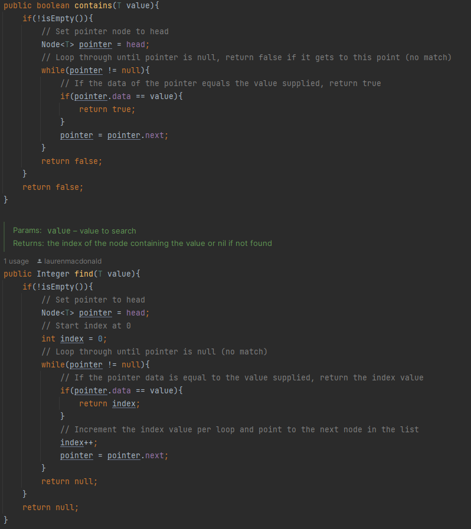

# Doubly Linked List Data Structure

> **Completed for PROG2400 Assignment 1**
> 
> Lauren MacDonald, February 2024
> 
> **Languages/Concepts**: Java, Data structures, doubly linked lists

## Class and Methods
### Node< T > Static Class
- Takes parameter< T >, using generic types to allow user to work with any data type.
- Has next and previous objects for pointer reference, and data that is stored.
#### Attributes
- **T data**: data of generic type held by the node
- **Node< T > next**: pointer reference to the node next to this node.
- **Node< T > previous**: pointer reference to the node previous to this node.

### DoublyLinkedList< T > Class
- Takes parameter of generic type, using generic types to allow for the list to work with any data type
- Doubly linked list class that sequentially links records (nodes).
- Contains references to previous (tail) and next (head) nodes in the sequence. Works with a Node<T> class.
#### Attributes
- **Node< T > head**: will point to the first node in list.
- **Node < T > tail**: will point to the last node in the list.

#### Methods
#### isEmpty and printNodes

#### append and prepend

#### size, head and tail

#### pop

#### at

#### contains and find

## Example of Program Output
This example uses a DoublyLinkedList of type Object to allow for different data types in the list. The list could be
of any type.

